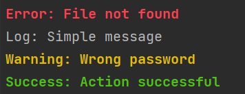
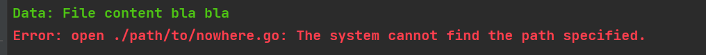
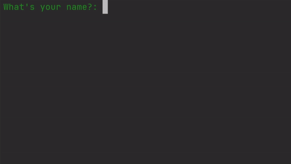

# Gonsole

Gonsole provides some simple operations which improve the ux inside the console

## Prerequisites

This project makes use of go 1.18 which is currently in beta so make sure your project is set up properly

## Install

Run `go get github.com/MangioneAndrea/Gonsole` to get the package

## Usage

### Console

The console is fairly simple to use.

- The first parameter is the message to print
- The second parameter is a flag to put before the message (optional)
- The third parameter is a filter function. It allows to print the message conditionally (optional)

```go
package main

import "github.com/MangioneAndrea/gonsole"

func main() {
	gonsole.Error("File not found", "Error")
	gonsole.Log("Simple message", "Log")
	gonsole.Warn("Wrong password", "Warning")
	gonsole.Success("Action successful", "Success")
}
```



```go
package main

import (
	"github.com/MangioneAndrea/gonsole"
	"os"
)

// ShowIfNotEmpty user defined conditional for the console to show
var ShowIfNotEmpty gonsole.ShowIf = func(elem interface{}) bool {
	return elem != ""
}

func main() {
	// this file is in the same folder as the runnable
	data, err := os.ReadFile("./examples/console/condition/example.txt")
	gonsole.Error(err, "Error", gonsole.ShowIfNotNil)
	gonsole.Success(string(data), "Data", ShowIfNotEmpty)
	// This file does not exist
	data, err = os.ReadFile("./path/to/nowhere.go")
	gonsole.Error(err, "Error", gonsole.ShowIfNotNil)
	gonsole.Success(string(data), "Data", ShowIfNotEmpty)
}

```



### CLI

The cli is a bit advanced and can be used mostly for small scripts. Each stage has a pointer as last parameter. The
result is stored there

```go
package main

import "github.com/MangioneAndrea/gonsole"

func main() {
	var name string
	var choco bool
	var color string
	var languages []string

	gonsole.Cli().
		Input("What's your name?", &name).
		Confirm("Do you like chocolate?", &choco).
		SelectOne("What's your favourite colour?", []string{"red", "blue", "yellow", "cyan"}, &color).
		SelectMany("What languages do you speak?", []string{"English", "German", "Italian", "French"}, &languages)
}
```



####    


 
